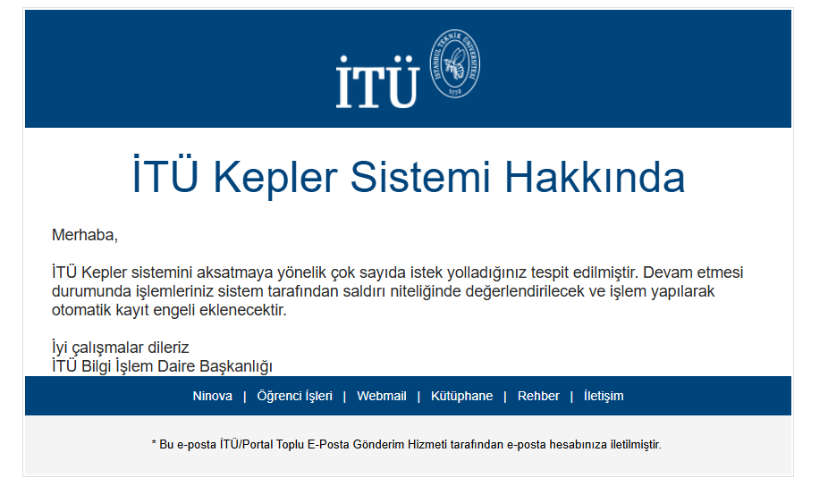

# Provenance & Context

This project originated from a personal automation built during course registration at Istanbul Technical University (İTÜ).

## Why the 15‑minute interval?

On **September 16, 2022**, I received an email from İTÜ titled **"İTÜ Kepler Sistemi Hakkında"**. The message warned that a *high number of requests* to the Kepler system had been detected from my activity and that, if it continued, these requests could be treated as an *attack* and an *automatic registration block* might be applied. (Sender: noreply@itu.edu.tr; department signature: İTÜ Bilgi İşlem Daire Başkanlığı.)

**Translation (summary):**

> We have detected a high volume of requests being sent to the İTÜ Kepler system. If this continues, your actions may be evaluated as an attack and an automatic registration block will be applied.

In response, I redesigned my scripts to **match the university’s page update cadence** and run on a **15‑minute loop with small random jitter** to avoid bursts and reduce load. This repository reflects that *ethical, rate‑limited* redesign.

## Privacy note

The original email (.eml) contains personal information (student email address and server routing headers). To protect privacy, I have **not** committed the raw file. This page includes a sanitized summary only.

## Screenshot (sanitized)

> The screenshot below shows the warning template from İTÜ about high request volume to the Kepler system.
> Personal details have been avoided here; if you commit your own screenshot, redact any email addresses or message IDs first.

